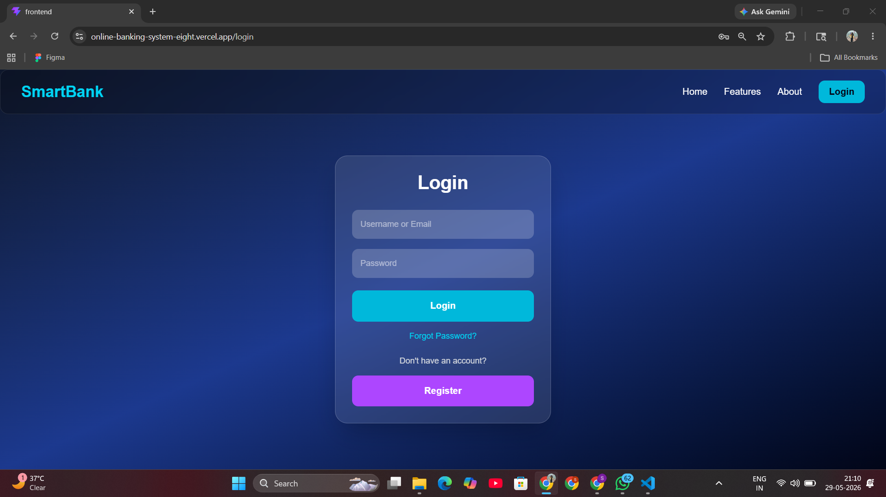
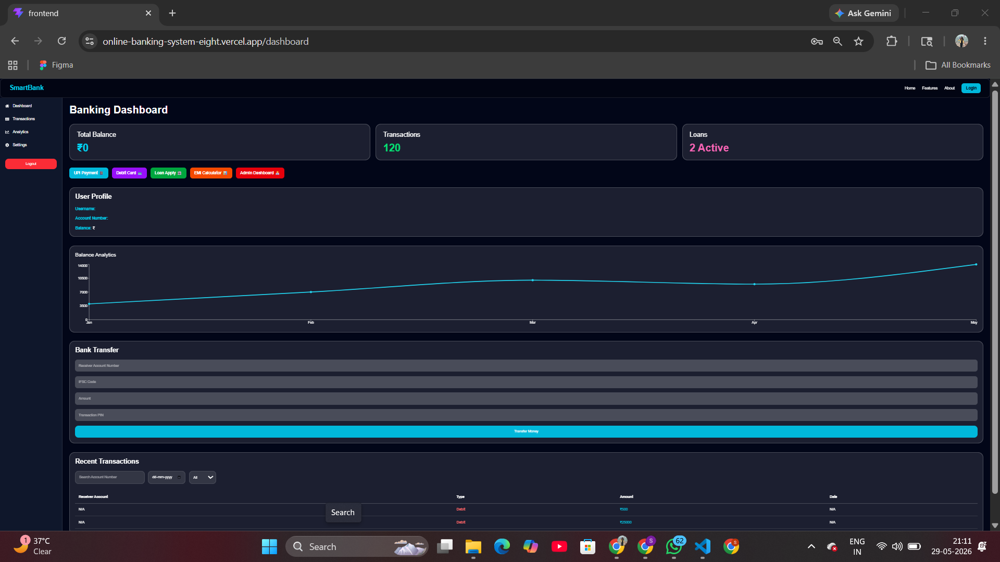
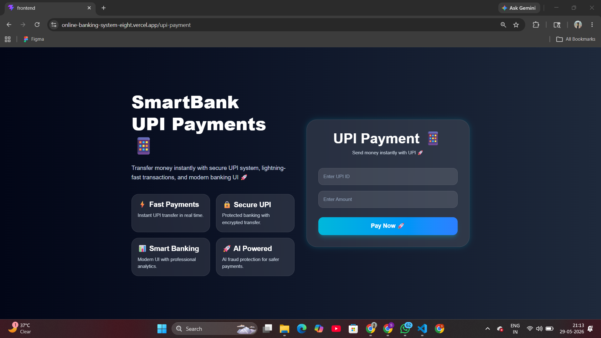
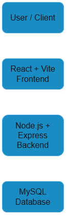

# SmartBank - Full Stack Online Banking Platform 🚀

## Overview

A full-stack banking platform with secure authentication, UPI transfers, transaction management, loan modules, and admin dashboard.

## Live Demo

Frontend:
https://online-banking-system-eight.vercel.app/

Backend:
https://onlinebankingsystem-qguw.onrender.com/

## Features

- User Authentication (JWT)
- UPI Payments
- Money Transfer
- Debit Card Module
- EMI Calculator
- Loan Management
- Admin Dashboard
- Transaction History
- Responsive UI

## Tech Stack

Frontend:
- React.js
- Vite
- Tailwind CSS
- Axios

Backend:
- Django
- Django REST Framework
- JWT Authentication
- Node.js
- Express.js

Database:
- MySQL

Deployment:
- Vercel
- Render

## 📸 Screenshots

### Login Page



### Dashboard



### UPI Payment



## 📂 Folder Structure

```text
OnlineBankingSystem
├── backend
│   ├── routes
│   ├── models
│   ├── controllers
│   ├── middleware
│   └── server.js

├── frontend
│   ├── src
│   │   ├── pages
│   │   ├── services
│   │   ├── components
│   │   └── assets
│
├── screenshots
│   ├── login-page.png
│   ├── dashboard.png
│   └── upi-payment.png
│
├── README.md
└── requirements.txt
```

## ⚙️ Setup Guide

### Backend Setup

```bash
cd backend
npm install
npm start
```

Backend server start ho jayega.

### Frontend Setup

```bash
cd frontend
npm install
npm run dev
```

Frontend local server run ho jayega.

### Environment Variables

Create `.env` file:

```env
VITE_API_URL=https://onlinebankingsystem-qguw.onrender.com
JWT_SECRET=your_secret_key
```


## 🔐 API Endpoints

| Method | Endpoint | Description |
|-------|-------|-------|
| POST | `/api/register` | Register new user |
| POST | `/api/login` | User login |
| GET | `/api/profile` | Get user profile |
| POST | `/api/upi-transfer` | Transfer money using UPI |
| GET | `/api/transactions` | Transaction history |
| POST | `/api/create-loan` | Create loan request |
| POST | `/api/send-money` | Send money |
| POST | `/api/forgot-password` | Forgot password |
| POST | `/api/reset-password` | Reset password |


## 🤝 Contribution Guide

1. Fork the repository

2. Create a new branch

```bash
git checkout -b feature-name
```

3. Commit changes

```bash
git commit -m "your changes"
```

4. Push code

```bash
git push origin feature-name
```

5. Open Pull Request


## 🏗 Architecture



## 👩‍💻 Author

**Sunidhi Shinde**

Aspiring Full Stack Developer passionate about building secure, scalable, and user-friendly web applications.

📌 Role: Full Stack Developer

💼 LinkedIn: https://www.linkedin.com/in/sunidhishinde/

🐙 GitHub: https://github.com/soniyaritgithub
